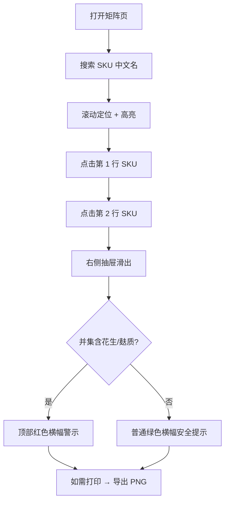

## 1. 产品概述

过敏原矩阵交互系统，为餐饮运营团队（门店经理、培训部、品控部）提供肯德基、麦当劳、华莱士三家快餐品牌共 40 个 SKU 的八大过敏原可视化查询工具。解决门店 printed 过敏原表更新滞后、店员口头回答口径不一导致的客诉风险问题。

- **核心目标**：一眼识别任意两个 SKU 是否共享高危过敏原（花生、麸质），支持培训打印
- **目标用户**：运营内网用户（无需登录）、门店培训讲师、品控巡检人员

## 2. 核心功能

### 2.1 用户角色
| 角色 | 登录方式 | 核心权限 |
|------|---------|---------|
| 运营人员 | 内网免登录 | 查看矩阵、搜索 SKU、对比过敏原、导出 PNG |
| 培训讲师 | 内网免登录 | 同上，侧重导出打印功能 |

### 2.2 功能模块
1. **过敏原矩阵页**：搜索栏、品牌折叠控制、矩阵画布、右侧对比抽屉、导出按钮
2. **SKU 对比抽屉**：双 SKU 过敏原并集展示、高危红色横幅、Y/M/N/U 图例
3. **PNG 导出模块**：当前视图快照、含色板图例、适合 A4 打印

### 2.3 页面详情
| 页面名称 | 模块名称 | 功能描述 |
|---------|---------|---------|
| 矩阵主页 | 顶部搜索栏 | SKU 中文名模糊匹配，回车滚动定位并高亮 |
| 矩阵主页 | 品牌折叠区 | 三家品牌独立折叠开关，折叠后展示该品牌最高风险色块 |
| 矩阵主页 | 画布矩阵 | 40×8 可缩放虚拟滚动网格，行/列 hover 高亮、色盲友好缩写 |
| 矩阵主页 | 对比抽屉 | 选中两行后滑出，展示并集，花生/麸质红色横幅警示 |
| 矩阵主页 | 导出工具栏 | PNG 快照导出按钮、图例常驻 |

## 3. 核心流程

门店经理接到家长询问 → 打开内网矩阵页 → 搜索定位两个 SKU → 点击两行 → 右侧抽屉展示过敏原并集 → 查看顶部是否有红色高危提示 → 如需培训材料导出 PNG。

## 4. 用户界面设计

### 4.1 设计风格
- **主色调**：深石板灰（slate-900）背景 + 警示红（rose-600）+ 安全绿（emerald-500）+ 琥珀黄（amber-500）
- **辅助色**：品牌主题色：肯德基红 #E4002B、麦当劳金 #FFC72C、华莱士橙 #FF7A00
- **按钮风格**：方角微圆（rounded-md）、hover 时轻微上浮阴影
- **字体**：标题 "Space Grotesk" Bold、正文 "JetBrains Mono" Regular（保证字母 Y/M/N/U 等宽对齐）
- **布局风格**：顶部工具栏固定、左侧品牌折叠面板 + 中间矩阵画布 + 右侧抽屉式面板
- **图标风格**：Lucide 线性图标

### 4.2 页面设计概要
| 页面名称 | 模块名称 | UI 元素 |
|---------|---------|---------|
| 矩阵主页 | 搜索栏 | 左侧放大镜图标、模糊匹配、下拉建议列表、背景 slate-800 |
| 矩阵主页 | 品牌折叠条 | 三品牌色块 + 折叠箭头 + 最高风险角标 |
| 矩阵主页 | 矩阵单元格 | Y=实心绿含白字、M=琥珀斜纹、N=浅灰、U=斜条纹红边、字母缩写左下标注 |
| 矩阵主页 | 行/列高亮 | hover 行：整行半透明白色蒙版；hover 列：整列半透明品牌色蒙版 |
| 矩阵主页 | 对比抽屉 | 400px 宽右侧滑入、顶部横幅、两列 SKU 信息卡、并集表格 |
| 矩阵主页 | 导出工具栏 | 右上角浮动按钮组：缩放+/−、重置、导出 PNG |

### 4.3 响应式
- **桌面优先（1280px+）**：三栏布局（品牌面板 180px + 矩阵自适应 + 抽屉 400px）
- **中端笔记本（1024-1279px）**：品牌面板收起为图标栏、抽屉 360px
- **移动适配**：不强制，运营内网主要为桌面端
- **触控优化**：矩阵单元格最小 36×36px，便于平板点选

### 4.4 色板对照表
| 风险等级 | 缩写 | 背景色 | 文字色 | 纹理 | 语义 |
|---------|-----|-------|-------|------|------|
| 含 | Y | emerald-500 / #10b981 | white | 实心 | 确认含过敏原 |
| 可能含 | M | amber-400 / #fbbf24 | slate-900 | 45° 斜纹半透 | 交叉污染风险 |
| 不含 | N | slate-200 / #e2e8f0 | slate-600 | 实心 | 确认不含 |
| 未标注 | U | slate-100 / #f1f5f9 | slate-500 | 斜条纹 + rose-300 边框 | 数据缺失，高风险 |
