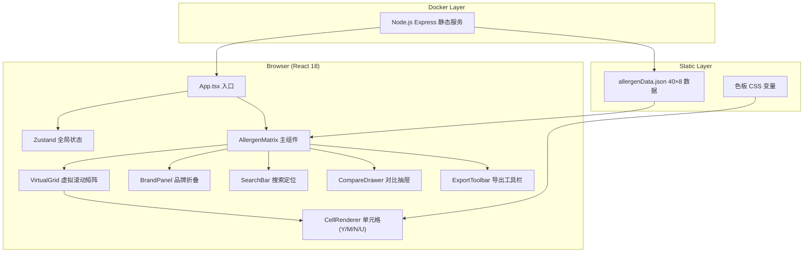
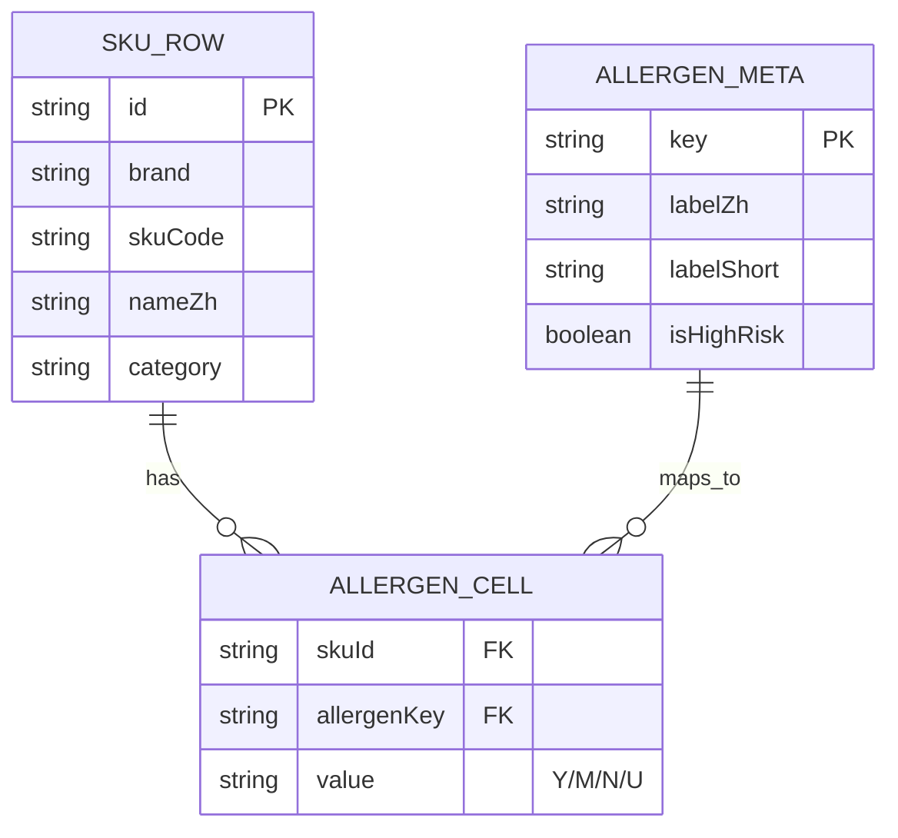

## 1. 架构设计



## 2. 技术说明
- **前端**：React@18 + TypeScript@5 + Vite@5 + TailwindCSS@3 + Zustand@4 + html2canvas@1
- **初始化工具**：vite-init（react-ts 模板）
- **后端**：Node.js Express@4 静态文件服务（仅用于 Docker 部署）
- **数据库**：无，纯 JSON 静态数据（`/public/data/allergenData.json`）
- **虚拟滚动**：`@tanstack/react-virtual` 处理行虚拟化（40 行虽少，但为扩展性保留）
- **PNG 导出**：html2canvas + canvas.toBlob

## 3. 路由定义
| 路由 | 用途 |
|-----|-----|
| / | 矩阵主页（单页应用，无其他路由） |

## 4. 数据模型

### 4.1 数据结构 Schema
```typescript
// 八大过敏原枚举
type AllergenType = 
  | 'gluten'      // 麸质
  | 'dairy'       // 乳制品
  | 'egg'         // 蛋类
  | 'peanut'      // 花生
  | 'treenut'     // 坚果
  | 'soy'         // 大豆
  | 'fish'        // 鱼类
  | 'shellfish';  // 甲壳类

// 单元格值：含/可能含/不含/未标注
type AllergenValue = 'Y' | 'M' | 'N' | 'U';

// 品牌枚举
type Brand = 'kfc' | 'mcdonalds' | '华莱士';

interface SKURow {
  id: string;              // 唯一ID，如 "kfc-001"
  brand: Brand;
  skuCode: string;         // 商品编码
  nameZh: string;          // 中文名
  nameEn?: string;         // 英文名（可选）
  category: string;        // 品类：汉堡/小食/饮料/甜点
  allergens: Record<AllergenType, AllergenValue>;
}

interface AllergenMeta {
  key: AllergenType;
  labelZh: string;         // 中文标签："花生"
  labelShort: string;      // 短标签："花生"
  isHighRisk: boolean;     // 是否高危（花生、麸质为 true）
}

interface AllergenDataset {
  version: string;         // 数据版本："2026-06-v1"
  updatedAt: string;       // ISO 时间戳
  allergens: AllergenMeta[];
  skus: SKURow[];
}
```

### 4.2 数据分布（40 SKU）
| 品牌 | SKU 数量 | 品类分布 |
|-----|---------|---------|
| 肯德基 (kfc) | 14 | 汉堡 5 / 小食 4 / 饮料 3 / 甜点 2 |
| 麦当劳 (mcdonalds) | 14 | 汉堡 5 / 小食 4 / 饮料 3 / 甜点 2 |
| 华莱士 | 12 | 汉堡 4 / 小食 3 / 饮料 3 / 甜点 2 |

### 4.3 ER 关系图


## 5. 核心性能优化
- **首屏 <300ms**：Vite 构建启用 rollup tree-shaking、JSON 数据 gzip 压缩、组件按需
- **虚拟滚动**：`@tanstack/react-virtual` 仅渲染可视区域行（约 15 行 ×8 = 120 单元格）
- **行/列高亮**：纯 CSS `:hover` + CSS 变量，避免 React 重渲染
- **品牌折叠**：Zustand 状态驱动 CSS `display:none`，禁止整页 reload
- **纹理样式**：CSS `repeating-linear-gradient` 实现斜纹，无需 SVG 图片资源

## 6. Docker 部署结构
```
/tl-0045-1
├── Dockerfile              # Node 18 Alpine + dist 拷贝
├── docker-compose.yml      # 暴露 8080 → 容器 3000
├── server/
│   └── static.ts           # Express serve-static + gzip
├── dist/                   # Vite build 产物
└── public/data/
    └── allergenData.json
```
